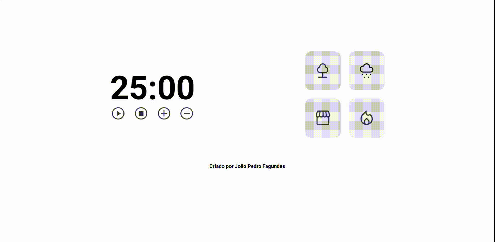
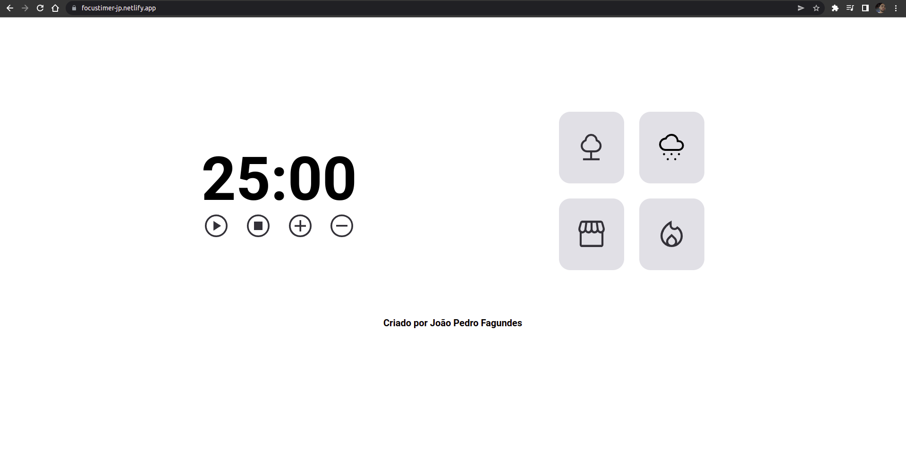
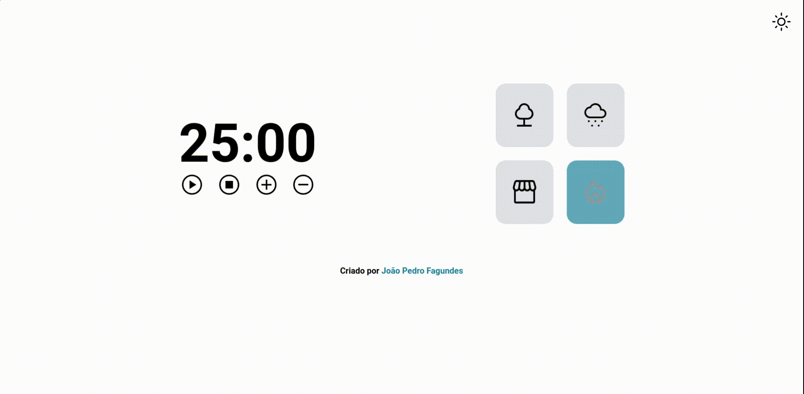

# Focus Timer

<h1 align="center">
    
</h1>

 

### 💻 Focus Timer

O desafio é construir uma página completa com contagem regressiva no estilo Pomodoro  
com HTML, Javascript e CSS. Foram aplicados conceitos como responsvidade e linguagem de programação javascript com em destaque cards de audio, recursividade e funções 
callbacks.
Pretendo adicionar mais alterações futuramente para aprimorar cada vez mais a aplicação

Acesse a página do projeto: [Clique Aqui](https://focustimer-jp.netlify.app/)

O que foi feito:

- Lógica e Algoritmos com Javascript;
- Adição de footer;
- Funcionalidade de botões de controle do play acionar timer, pausar e parar;
- Funcionalidade de botões de controle do play aumenta em mais 5 minutos o tempo do timer;
- Funcionalidade de botões de controle do play dimuinuir em mais 5 minutos o tempo do timer;
- Cards de audio que acionar som e pausa;
- Variáveis, operadores matemáticos e operadores comparativos;
- Tipos de dados no javascipt;
- Manipular a DOM;
- Funções callbacks;
- Recursividade;
- ES6 Modules;
- Estruturando HTML com tags semânticas;
- Responsividade com CSS Flex Box;
- Unidade de medida flexível;
- Posição dos elementos na tela;
- Trabalhando com cores e fontes;
- Alinhando e posicionando textos e elementos;
- Aplicando os espaçamentos;
- Bordas e classificações de elementos;
- O conceito Box Model do CSS flexbox;
- Animações CSS e transições;

Aplicado meu conhecimento do Explorer da Rocketseat conceitos de forma prática 
nesse projeto, com as aulas:

- Conhecendo novos conceitos de HTML e CSS;
- Avançando no HTML e CSS;
- Responsividade;
- Introdução á Programação, Lógica e Algoritmos com Javascript;
- Avançando na Programação WEB com Javacript;
  
 

- [EXPLORER - Rocketseat](https://www.rocketseat.com.br/explorer)
- [Figma do Projeto - Focus Timer](https://www.figma.com/file/zCLi7cnneAy2bHtBdQ0Gb9/Stage-05-Focus-Timer-2.0-Copy?fuid=1095480089230508299)

## Imagem do Projeto concluído:
 

  

 
Gif do Projeto Mobile

## 🧪 Tecnologias

Aplicação desenvolvida usando as seguintes tecnologias:

- [HTML5](https://www.w3schools.com/html/default.asp)
- [CSS3](https://www.w3schools.com/css/default.asp)
- [Javascript](https://developer.mozilla.org/pt-BR/docs/Web/JavaScript)

&nbsp;

Criado por João Pedro Fagundes

- ## Meu LinkedIn - 
